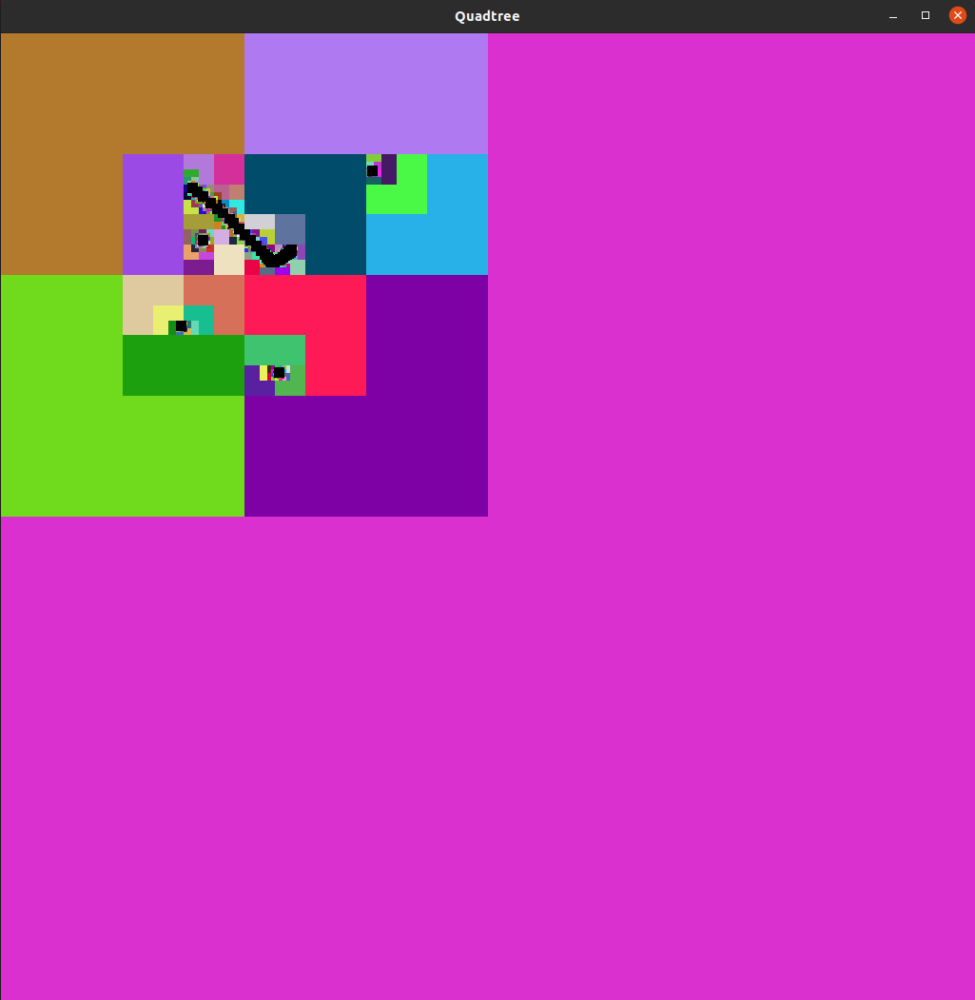

Quadtree X OpenGL
=================

This is the OpenGL visualization of the quadtree.

Build
-----

.. code-block:: bash

   git clone "repo-link"
   g++ quad-x-gl.cpp quadtree.cpp -o quad-x-gl -lGL -lGLU -lglut
   ./quad-x-gl

Usage
-----

- Drag mouse to draw.
- Use TAB key to switch between drawing and visualizing.
- Click mouse to visualize.
